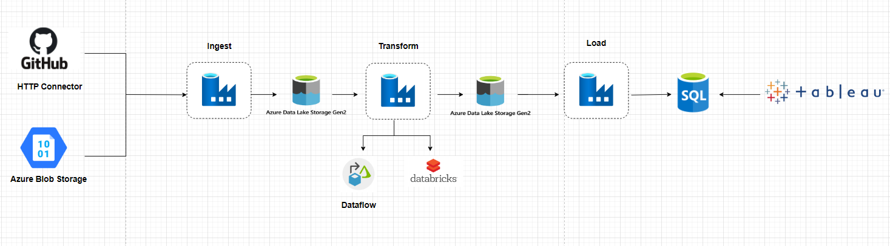
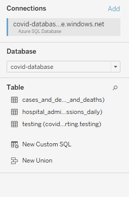

# COVID project implemented using Azure Service End-to-End ELT pipeline

 

## Goal Of The Project:
The data used for the project is of Europe. The data has been extracted from EuroStat and European Centre for Disease Prevention and Control (ECDC) available in GitHub.
<ul>
    <li>The main objective of this project was to implement the Azure services like  <b> Azure Data Factory, Azure Blob Storage, Azure Data Lake to extract, transform and load the data into Azure SQL database and finally visuazlize the data using Tableau. </b></li>
</ul>

## Meta data about the files used in the project:
<table>
<thead>
  <tr>
    <th>File Names</th>
    <th>Description of file</th>
  </tr>
</thead>
<tbody>
  <tr>
    <td>1. population_by_age.tsv.gz (EuroStat/Blob)</td>
    <td>This is a zipped file that contains the population data of countries.</td>
  </tr>
  <tr>
    <td>2. cases_deaths.csv (ECDC from GitHub)</td>
    <td>This csv contains the number emerging Covid Cases and Deaths followed by the each day.</td>
  </tr>
  <tr>
    <td>3. hospital_admissions.csv (ECDC from GitHub)</td>
    <td>This csv file contains the Daily Hospital Admissions, Daily ICU admissions, Weekly Hospital Admissions per 100k, Weekly ICU Admissions per 100k.</td>
  </tr>
  <tr>
    <td>4. testing.csv (ECDC from GitHub)</td>
    <td>This csv file contains the emerging covid cases, tests being done, testing_rate and covid postive_rate on the weekly basis.</td>
  </tr>
  <tr>
    <td>5. Country response (ECDC from GitHub)</td>
    <td>How different countries responded to the alarming cases and impacts to COVID outbreak.</td>
  </tr>
  <tr>
    <td>6. lookups (Blob)</td>
    <td>Other miscellaneous files like Calendar Lookup/dim and Country lookup/dim files used.</td>
  </tr>
</tbody>
</table>

## Table of Contents:
<ol>
    <li>Data Ingestion</li>
    <ol type='a'>
        <li><a href="#populationdata"> <b>Ingest Population data from Azure Blob Storage to Azure Data Lake </a></b></li>
    </li>
    <li><a href="#ecdcdata"> <b>Ingest ECDC data from GitHub to Azure Data Lake using HTTP linkedservice</a></b></li>
    </li>
    </ol>
    <li>Data Transformation</li>
    <ol type='a'>
    <li><a href="#dataflow"> <b>Transformation using Data Flow</b> </a></li>
    </ol>
</ol>
<h2>1. Data Ingestion </h2>
<h3 id ="populationdata">a. Ingest Population data from Azure Blob Storage to Azure Data Lake:</h3>

First, we are ingesting the data from Azure Blob Storage to the raw folder in Azure Data Lake.

 
 
<b>Pipeline to ingest data from Azure Blob Storage for population data:</b>
 
 
 

<b>STEPS involved: </b>
<ol>
    <li>Validation:</li>
    
The first phase is the data validation, if the file exists in the Azure blob storage then we are good to go and will proceed to the next stage.

    <li>Get Metadata:</li>
    
Once, the availability of the data has been verified, we will extract the metadata, here we are extracting the number of columns of the data being processed.

    <li>If Condition:</li>
    
Here, we will check the number of columns, if the number of columns is greated than 13, then it is an error, the number of columns we are expecting for our dataset to have is 13. So, if the dataset has more than 13 columns, we will send an E-mail notifying us that the data has more number of columns. Else, if the condition matches, we will copy the data to the DataLake Gen-2 in the raw/population folder and then delete it once it has been copied to clean up the space.

</ol>
 
<h3 id ="ecdcdata">b. Ingest ECDC data from GitHub to Azure Data Lake using HTTP linked-service:</h3>

In total we will be ingesting 4 files:
    <ul>
        <li> COVID-19 new cases and deaths by country
        <li> COVID-19 Hospital admissions & ICU cases
        <li> COVID-19 Testing numbers
        <li> Country Response to COVID-19
    </ul>

<b>Pipeline to ingest data from Azure Blob Storage for population data:</b>
 
 
 
<b>STEPS involved: </b>
<ol>
    <li>Lookup:</li>
    This operation will lookup for a JSON file created as a dataset. This JSON file contains the information such as:
     
    - BaseURL (linkedservice) 
    - RelativeURL (dataset) 
    - FileName (file to be saved as)
    <li>ForEach:</li>
    Once the file has been found in the Lookup phase, we will loop through the JSON file and pass each record to the copy activity.
    <li>Copy Activity:</li>
    In copy activity, we will pass the <b> BaseURL, RelativeURL and the Filename</b> to pull the data from GitHub repo and copy it to the DataLake Gen-2 in the raw folder.
</ol>

For this pipeline to be executed, I have created a scheduled trigger that would execute the pipeline to ingest the ECDC data every hour without an end date.

 

<h2> 2. Data Transformation </h2>
<h3 id="dataflow"> a. Transformation using Data flow </h3>

<b>1. Transforming cases and deaths data using Data Flow in Azure Data Factory.</b>

<b>Data flow for cases and deaths transformation: </b>
 

Here, the dataset goes through multiple transformation phases, and finally the processed data is stored in Data Lake/processed folder.

2. Transforming Hospital Admissions data using Data flow 

 

3. Transforming Population data using Data Bricks 

Here, I have mounted Databricks with Azure Data lake, and then transformed the Population data and then stored back to the Data Lake in Processed folder.

4. Copying the final clean data to the Azure SQL database 

In total, I have created 3 tables:  
- cases and deaths  
- hospital admissions daily  
- testing (COVID testing) 

5. Visualize the data 

Connecting to Azure SQL database from Tableau:
 

<h3>Dashboard Visualizing Cases and Death Counts Per Country </h3>

<noscript></noscript><object class='tableauViz'  style='display:none;'><param name='host_url' value='https%3A%2F%2Fpublic.tableau.com%2F' /> <param name='embed_code_version' value='3' /> <param name='path' value='shared&#47;P8XS9DHNH' /> <param name='toolbar' value='yes' /><param name='static_image' value='https:&#47;&#47;public.tableau.com&#47;static&#47;images&#47;P8&#47;P8XS9DHNH&#47;1.png' /> <param name='animate_transition' value='yes' /><param name='display_static_image' value='yes' /><param name='display_spinner' value='yes' /><param name='display_overlay' value='yes' /><param name='display_count' value='yes' /><param name='language' value='en-US' /><param name='filter' value='publish=yes' /></object>
                

